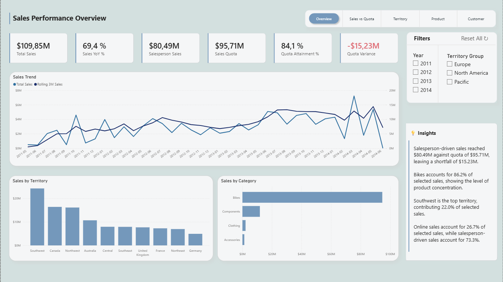
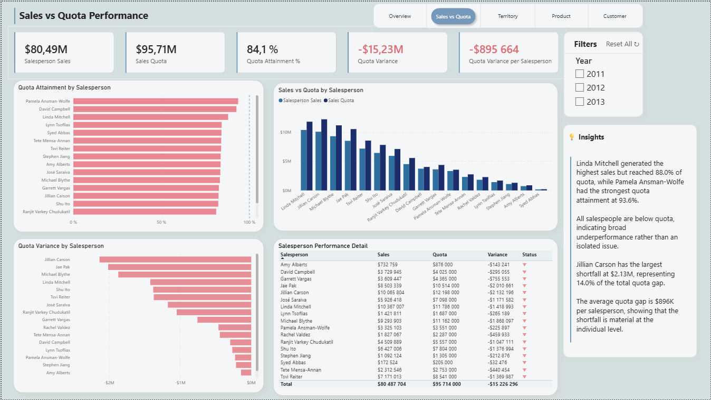
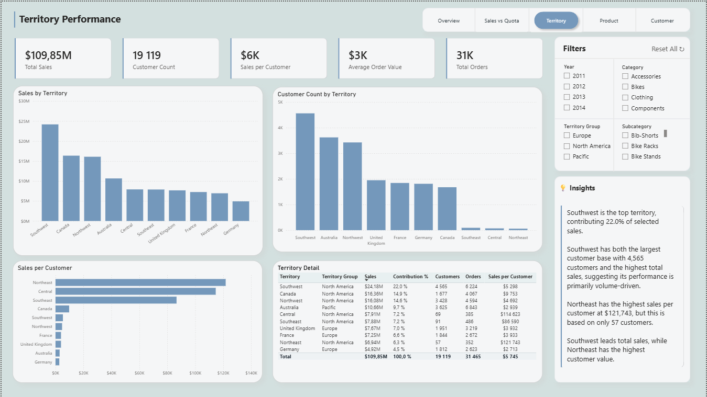
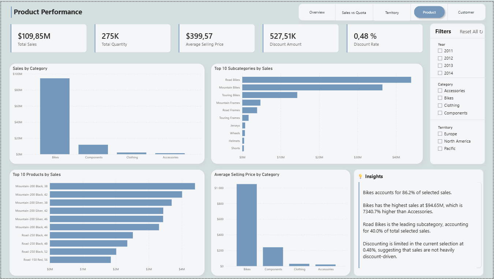
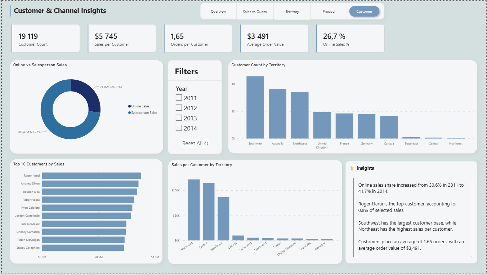

# AdventureWorks Sales Performance & Quota Analysis

## Project Overview

This project is a business intelligence report built with SQL Server and Power BI.

The goal is to analyze sales performance, quota attainment, territory performance, product performance, and customer/channel behavior using the AdventureWorks2022 sample database.

Project workflow:

- Extracting and transforming data from a relational SQL Server database
- Creating an analytics layer using SQL views
- Building a star-style data model in Power BI
- Creating DAX measures for sales, quota, customer, product, and territory analysis
- Designing an interactive Power BI report with KPI cards, charts, tables, slicers, and dynamic business insights

---

## Business Objective

The objective of the report is to answer key business questions such as:

- How is overall sales performance developing over time?
- Are salespeople reaching their sales quotas?
- Which territories generate the most sales and customer value?
- Which product categories, subcategories, and products drive revenue?
- How do online sales compare to salesperson-driven sales?
- Are sales concentrated among a few customers or spread across a broad customer base?

---

## Tools Used

- SQL Server Management Studio
- Power BI Desktop
- Power Query
- DAX

---

## Data Source

The project uses the Microsoft AdventureWorks2022 sample database.

Database backup used in this project:  
[AdventureWorks2022.bak](https://github.com/Microsoft/sql-server-samples/releases/download/adventureworks/AdventureWorks2022.bak)

---

## SQL Analytics Layer

The SQL layer is stored in:

`sql/analytics_views.sql`

The script creates an `analytics` schema and the following views:

| View | Description |
|---|---|
| `analytics.fact_sales` | Sales order line fact table |
| `analytics.fact_sales_quota` | Sales quota fact table by salesperson and quota date |
| `analytics.dim_date` | Date dimension based on sales and quota date ranges |
| `analytics.dim_product` | Product dimension with category and subcategory |
| `analytics.dim_customer` | Customer dimension with customer type and territory |
| `analytics.dim_salesperson` | Salesperson dimension with employee and quota-related attributes |
| `analytics.dim_territory` | Sales territory dimension |

---

## Data Model

The Power BI model uses a star-style structure with two fact tables:

- `fact_sales`
- `fact_sales_quota`

Shared dimensions include:

- `dim_date`
- `dim_product`
- `dim_customer`
- `dim_salesperson`
- `dim_territory`

Key relationships:

| Dimension | Fact table | Relationship |
|---|---|---|
| `dim_date[Date]` | `fact_sales[OrderDate]` | One-to-many |
| `dim_date[Date]` | `fact_sales_quota[QuotaDate]` | One-to-many |
| `dim_product[ProductID]` | `fact_sales[ProductID]` | One-to-many |
| `dim_customer[CustomerID]` | `fact_sales[CustomerID]` | One-to-many |
| `dim_salesperson[SalesPersonID]` | `fact_sales[SalesPersonID]` | One-to-many |
| `dim_salesperson[SalesPersonID]` | `fact_sales_quota[SalesPersonID]` | One-to-many |
| `dim_territory[TerritoryID]` | `fact_sales[TerritoryID]` | One-to-many |

---

## Report Pages

The Power BI report contains five pages.

### 1. Sales Performance Overview

Provides an overview of total sales, sales quota, quota attainment, and sales trends over time.

### 2. Sales vs Quota Performance

Analyzes salesperson-driven sales against assigned sales quotas.

The page includes quota attainment, quota variance, and salesperson-level performance comparisons.

### 3. Territory Performance

Compares territories by sales, customer count, sales per customer, average order value, and order volume.

### 4. Product Performance

Analyzes sales by product category, subcategory, and product.

Also includes average selling price, quantity sold, discount amount, and discount rate.

### 5. Customer & Channel Insights

Explores customer behavior, online vs salesperson-driven sales, customer distribution by territory, sales per customer, and top customer concentration.

---

## How to Use

1. Download and restore the [AdventureWorks2022.bak](https://github.com/Microsoft/sql-server-samples/releases/download/adventureworks/AdventureWorks2022.bak) database in SQL Server.
2. Run the SQL script located in `sql/analytics_views.sql`.
3. Open the Power BI file located in `powerbi/`.
4. Refresh the data connection if needed.
5. Explore the report pages and slicers.

---